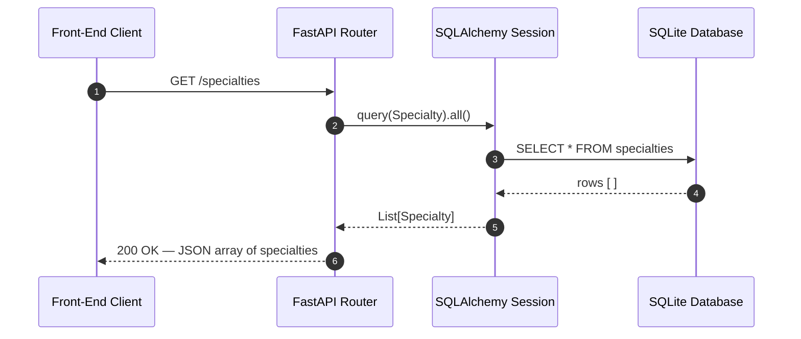

```mermaid
sequenceDiagram
    autonumber
    participant FE as Front-End Client
    participant Router as FastAPI Router
    participant ORM as SQLAlchemy Session
    participant DB as SQLite Database
    FE->>Router: GET /specialties
    Router->>ORM: query(Specialty).all()
    ORM->>DB: SELECT * FROM specialties
    DB-->>ORM: rows [ ]
    ORM-->>Router: List[Specialty]
    Router-->>FE: 200 OK — JSON array of specialties
```
