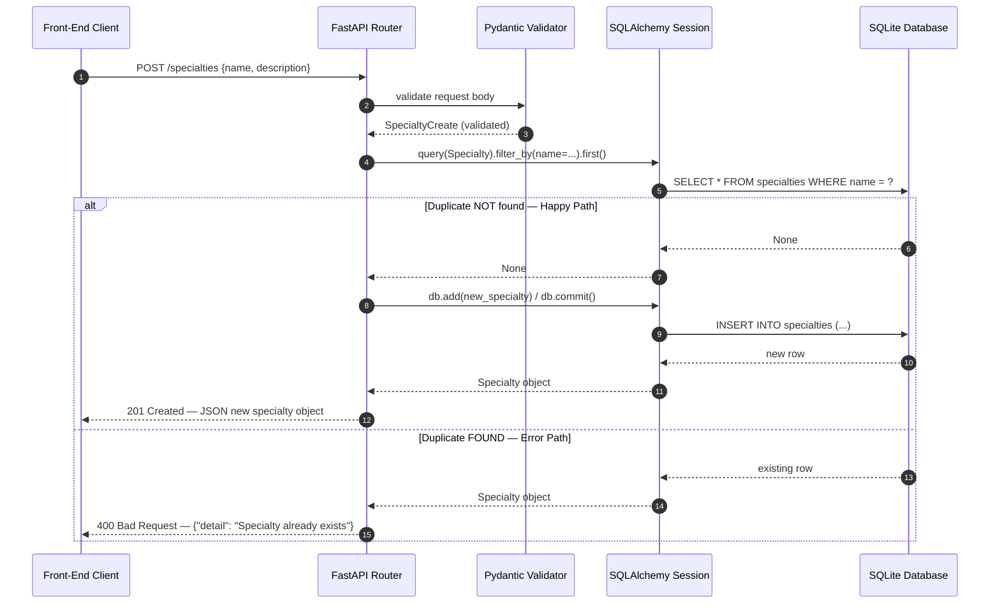

```mermaid
sequenceDiagram
    autonumber
    participant FE as Front-End Client
    participant Router as FastAPI Router
    participant PV as Pydantic Validator
    participant ORM as SQLAlchemy Session
    participant DB as SQLite Database
    FE->>Router: POST /specialties  {name, description}
    Router->>PV: validate request body
    PV-->>Router: SpecialtyCreate (validated)
    Router->>ORM: query(Specialty).filter_by(name=...).first()
    ORM->>DB: SELECT * FROM specialties WHERE name = ?
    alt Duplicate NOT found — Happy Path
        DB-->>ORM: None
        ORM-->>Router: None
        Router->>ORM: db.add(new_specialty) / db.commit()
        ORM->>DB: INSERT INTO specialties (...)
        DB-->>ORM: new row
        ORM-->>Router: Specialty object
        Router-->>FE: 201 Created — JSON new specialty object
    else Duplicate FOUND — Error Path
        DB-->>ORM: existing row
        ORM-->>Router: Specialty object
        Router-->>FE: 400 Bad Request — {"detail": "Specialty already exists"}
    end
```
