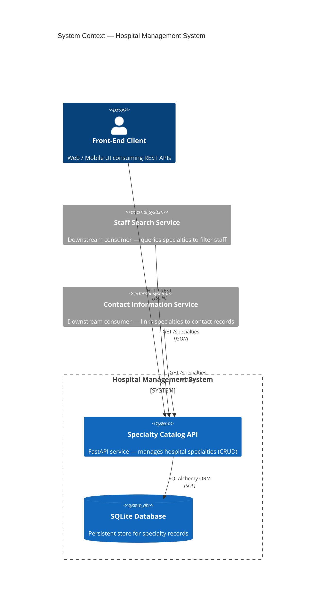

```mermaid
C4Context
    title System Context — Hospital Management System
    Person(frontEnd, "Front-End Client", "Web / Mobile UI consuming REST APIs")
    System_Boundary(hms, "Hospital Management System") {
        System(specialtyApi, "Specialty Catalog API", "FastAPI service — manages hospital specialties (CRUD)")
        SystemDb(sqliteDb, "SQLite Database", "Persistent store for specialty records")
    }
    System_Ext(staffSearch, "Staff Search Service", "Downstream consumer — queries specialties to filter staff")
    System_Ext(contactInfo, "Contact Information Service", "Downstream consumer — links specialties to contact records")
    Rel(frontEnd, specialtyApi, "HTTP REST", "JSON")
    Rel(specialtyApi, sqliteDb, "SQLAlchemy ORM", "SQL")
    Rel(staffSearch, specialtyApi, "GET /specialties", "JSON")
    Rel(contactInfo, specialtyApi, "GET /specialties", "JSON")
```
