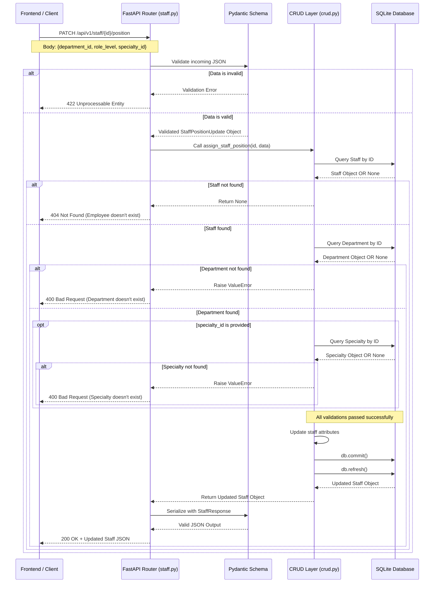

# 🏥 END-27: Assign Initial Staff Position and Department Data

**Ticket:** END-27  
**Descripción:** Asignar o actualizar el cargo, departamento y especialidad de un empleado existente  
**Estado:** ✅ Completado  
**Fecha de Creación:** 2026-03-02  

---

## 🛡️ Arquitectura y Seguridad de Datos

Para cumplir con los estándares de software médico, nuestra arquitectura diferencia estrictamente entre dos tipos de datos:

* **PII (Personally Identifiable Information):** Datos que identifican a la persona (nombres, correos, teléfonos).
* **PHI (Protected Health Information):** Datos médicos sensibles (historiales clínicos, diagnósticos).

**Estrategia de Seguridad Implementada:**
Utilizamos Schemas de Pydantic como "filtros de salida". Dependiendo del rol del usuario (Ej. Recepcionista vs. Médico), la API devuelve un Schema distinto para garantizar que el PHI nunca llegue al Frontend si el usuario no tiene los permisos necesarios.

---

## 🌱 Datos de Prueba (Database Seeding)

Para facilitar el desarrollo del Frontend y las pruebas de QA, la base de datos cuenta con un script de siembra automático (`seed.py`).

Para poblar tu base de datos local con información de prueba, ejecuta:
```bash
python -m app.seed
```

**Datos disponibles para pruebas:**
* **Departamentos (`department_id`):** 1 (Urgencias), 2 (Cirugía), 3 (Pediatría).
* **Especialidades (`specialty_id`):** 1 (Cardiología), 2 (Neurología), 3 (Traumatología).
* **Empleados (`staff_id`):** 1, 2, 3, 4 (Médicos y enfermeras pre-cargados).

---

## 🛠️ Endpoint API: Asignar Cargo a Empleado

### Información General

Permite actualizar el departamento, el cargo y (opcionalmente) la especialidad de un empleado existente.

| Propiedad | Valor |
|-----------|-------|
| **Método HTTP** | `PATCH` |
| **URL Base** | `http://localhost:8000` |
| **Ruta** | `/api/v1/staff/{staff_id}/position` |
| **URL Completa** | `http://localhost:8000/api/v1/staff/{staff_id}/position` |
| **Autenticación** | No requerida (fase inicial) |
| **Rate Limit** | Sin límite (desarrollo) |

---

## 📥 Parámetros de la Solicitud

### 1. Parámetros de Ruta (Path Parameters)

| Parámetro | Tipo | Requerido | Descripción | Ejemplo |
|-----------|------|-----------|-------------|---------|
| `staff_id` | Integer | ✅ Sí | ID numérico del empleado | `1`, `2`, `3` |

### 2. Cuerpo de la Solicitud (Request Body - JSON)

*Nota: `specialty_id` es **opcional**.*

```json
{
  "department_id": 2,
  "role_level": "Jefe de Cirugía",
  "specialty_id": 1
}
```

| Campo | Tipo | Requerido | Descripción | Ejemplo |
|-------|------|-----------|-------------|---------|
| `department_id` | Integer | ✅ Sí | ID del departamento asignado | `1` (Urgencias), `2` (Cirugía), `3` (Pediatría) |
| `role_level` | String | ✅ Sí | Nivel/cargo del empleado | `"Médico Titular"`, `"Jefe de Cirugía"`, `"Enfermera Jefe"` |
| `specialty_id` | Integer | ❌ No | ID de la especialidad (solo aplicable a médicos) | `1` (Cardiología), `2` (Neurología), `3` (Traumatología) |

---

## 📤 Respuestas Esperadas

### ✅ 200 OK - Éxito

La solicitud fue procesada exitosamente y el empleado fue actualizado.

```json
{
  "id": 1,
  "first_name": "Carlos",
  "last_name": "Mendoza",
  "email": "cmendoza@hospital.com",
  "role_level": "Jefe de Cirugía",
  "department_id": 2,
  "specialty_id": 1,
  "status": "Activo"
}
```

**Headers Devueltos:**
```
Content-Type: application/json
HTTP/1.1 200 OK
```

---

### ❌ 404 Not Found - Empleado No Existe

El `staff_id` proporcionado no existe en la base de datos.

```json
{
  "detail": "Error: El empleado con ID 999 no existe en el sistema."
}
```

**Cuándo ocurre:**
- El empleado fue eliminado de la base de datos
- El ID proporcionado es incorrecto
- El empleado nunca fue creado

---

### ❌ 400 Bad Request - Datos Inválidos

Uno de los IDs de referencia (departamento o especialidad) no existe o es inválido.

```json
{
  "detail": "Error: El departamento con ID 99 no existe en el hospital."
}
```

**Variaciones:**
```json
{
  "detail": "Error: La especialidad con ID 99 no existe."
}
```

**Cuándo ocurre:**
- El `department_id` no corresponde a un departamento existente
- El `specialty_id` (si se proporciona) no corresponde a una especialidad existente
- Los valores son números fuera de rango

---

### ❌ 422 Unprocessable Entity - Error de Formato

La solicitud JSON no tiene el formato correcto o faltan campos requeridos.

```json
{
  "detail": [
    {
      "type": "missing",
      "loc": ["body", "department_id"],
      "msg": "Field required",
      "input": {}
    },
    {
      "type": "missing",
      "loc": ["body", "role_level"],
      "msg": "Field required",
      "input": {}
    }
  ]
}
```

**Cuándo ocurre:**
- Faltan campos requeridos (`department_id`, `role_level`)
- Los tipos de datos son incorrectos (ej: string en lugar de integer)
- JSON malformado

---

## 📊 Flujo de Datos (Diagrama de Secuencia)

El siguiente diagrama ilustra cómo la API valida y procesa la asignación de cargos:



---

## 💻 Ejemplos de Uso

### Ejemplo 1: Asignar médico a Cardiología en Urgencias

**Solicitud:**
```bash
curl -X PATCH "http://localhost:8000/api/v1/staff/1/position" \
  -H "Content-Type: application/json" \
  -d '{
    "department_id": 1,
    "role_level": "Médico Titular",
    "specialty_id": 1
  }'
```

**Respuesta (200 OK):**
```json
{
  "id": 1,
  "first_name": "Carlos",
  "last_name": "Mendoza",
  "email": "cmendoza@hospital.com",
  "role_level": "Médico Titular",
  "department_id": 1,
  "specialty_id": 1,
  "status": "Activo"
}
```

---

### Ejemplo 2: Asignar enfermera sin especialidad

**Solicitud:**
```bash
curl -X PATCH "http://localhost:8000/api/v1/staff/2/position" \
  -H "Content-Type: application/json" \
  -d '{
    "department_id": 2,
    "role_level": "Enfermera Jefe"
  }'
```

**Respuesta (200 OK):**
```json
{
  "id": 2,
  "first_name": "Ana",
  "last_name": "Gómez",
  "email": "agomez@hospital.com",
  "role_level": "Enfermera Jefe",
  "department_id": 2,
  "specialty_id": null,
  "status": "Activo"
}
```

---

### Ejemplo 3: Error - Departamento no existe

**Solicitud:**
```bash
curl -X PATCH "http://localhost:8000/api/v1/staff/1/position" \
  -H "Content-Type: application/json" \
  -d '{
    "department_id": 99,
    "role_level": "Médico Residente"
  }'
```

**Respuesta (400 Bad Request):**
```json
{
  "detail": "Error: El departamento con ID 99 no existe en el hospital."
}
```

---

### Ejemplo 4: Error - Empleado no existe

**Solicitud:**
```bash
curl -X PATCH "http://localhost:8000/api/v1/staff/999/position" \
  -H "Content-Type: application/json" \
  -d '{
    "department_id": 1,
    "role_level": "Médico"
  }'
```

**Respuesta (404 Not Found):**
```json
{
  "detail": "Error: El empleado con ID 999 no existe en el sistema."
}
```

---

## 📁 Archivos Involucrados

| Archivo | Descripción | Responsabilidad |
|---------|-------------|-----------------|
| `app/routers/staff.py` | Router FastAPI | Endpoint HTTP y manejo de errores |
| `app/schemas.py` | Schemas Pydantic | Validación de entrada/salida |
| `app/crud.py` | Funciones CRUD | Lógica de base de datos |
| `app/models.py` | Modelos SQLAlchemy | Estructura de tablas |
| `app/database.py` | Configuración BD | Conexión a SQLite |

---

## 🧪 Pruebas Recomendadas

### Test 1: Asignación exitosa
```python
def test_assign_position_success():
    # Asignar un empleado existente a un departamento existente
    response = client.patch("/api/v1/staff/1/position", json={
        "department_id": 2,
        "role_level": "Jefe",
        "specialty_id": 1
    })
    assert response.status_code == 200
    assert response.json()["role_level"] == "Jefe"
```

### Test 2: Empleado no existe (404)
```python
def test_assign_position_not_found():
    response = client.patch("/api/v1/staff/999/position", json={
        "department_id": 1,
        "role_level": "Médico"
    })
    assert response.status_code == 404
```

### Test 3: Departamento inválido (400)
```python
def test_assign_position_invalid_department():
    response = client.patch("/api/v1/staff/1/position", json={
        "department_id": 99,
        "role_level": "Médico"
    })
    assert response.status_code == 400
```

### Test 4: Especialidad opcional
```python
def test_assign_position_without_specialty():
    response = client.patch("/api/v1/staff/1/position", json={
        "department_id": 2,
        "role_level": "Enfermera"
    })
    assert response.status_code == 200
    assert response.json()["specialty_id"] is None
```

---

## 🚀 Implementación Técnica

### Validaciones Realizadas (En Orden)

1. ✅ **Validación de JSON:** Pydantic verifica formato y tipos
2. ✅ **Existencia del Empleado:** Consulta BD por `staff_id`
3. ✅ **Existencia del Departamento:** Consulta BD por `department_id`
4. ✅ **Existencia de Especialidad:** Solo si `specialty_id` fue proporcionado
5. ✅ **Actualización:** Se guardan los cambios en BD
6. ✅ **Serialización:** Se devuelve el objeto actualizado con StaffResponse

### Stack Tecnológico

| Tecnología | Versión | Propósito |
|------------|---------|----------|
| **FastAPI** | 0.115.6 | Framework web |
| **Pydantic** | 2.12.5 | Validación de datos |
| **SQLAlchemy** | 2.0.37 | ORM para base de datos |
| **SQLite** | Nativa | Base de datos |
| **Uvicorn** | 0.34.0 | Servidor ASGI |

---

## 📝 Notas y Consideraciones

1. **Especialidad opcional:** Un empleado puede no tener especialidad (ej. recepcionista, conserje).
2. **Validación en capas:** Cada capa (Router → Schema → CRUD) valida su responsabilidad.
3. **Idempotencia:** Se puede ejecutar el mismo request múltiples veces sin efectos secundarios.
4. **Transacciones:** Se usa `db.commit()` para garantizar persistencia atómica.
5. **Seguridad:** No se retorna información sensible (PHI) sin autenticación.

---

## ✅ Estado de Implementación

| Componente | Estado | Notas |
|-----------|--------|-------|
| Endpoint PATCH | ✅ Completo | Funcional |
| Schema StaffPositionUpdate | ✅ Completo | Validaciones incluidas |
| Schema StaffResponse | ✅ Completo | Serialización correcta |
| Función CRUD assign_staff_position | ✅ Completo | Con validaciones |
| Manejo de errores | ✅ Completo | HTTP 404, 400, 422 |
| Datos de prueba | ✅ Completo | Script seed.py idempotente |
| Documentación | ✅ Completo | Este archivo |

---

## 🔗 Referencias Relacionadas

- **END-34:** Manage Specialties
- **END-35:** Staff Position Workflow
- **Database Schema:** `app/models.py`
- **API Documentation:** `http://localhost:8000/docs` (Swagger UI)

---

**Última Actualización:** 2026-03-02  
**Autor:** Sistema de Gestión Hospitalaria  
**Versión:** 1.0.0

