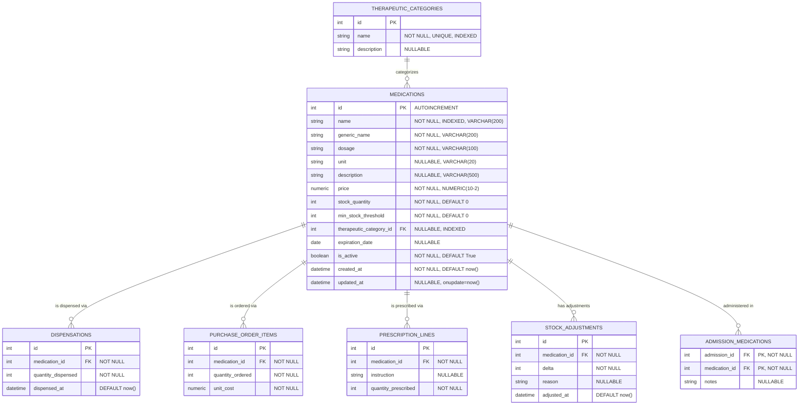
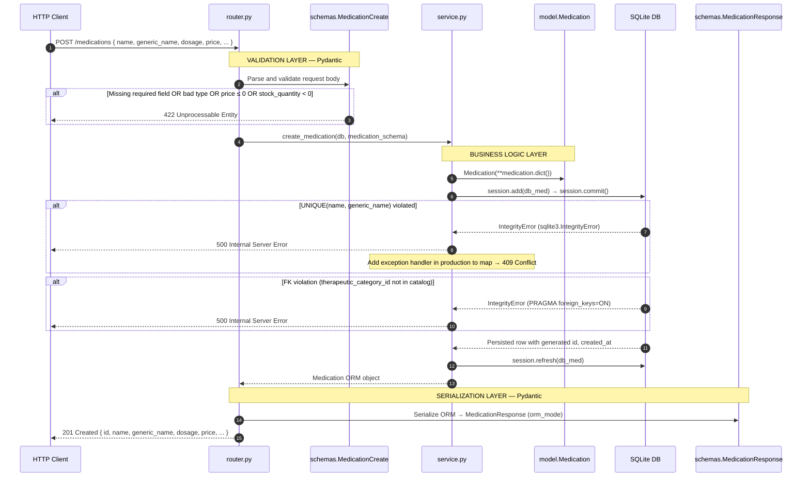
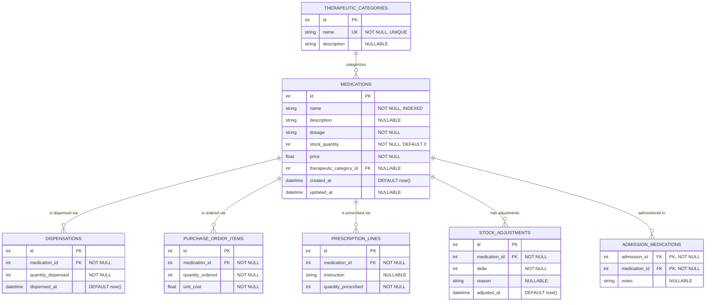
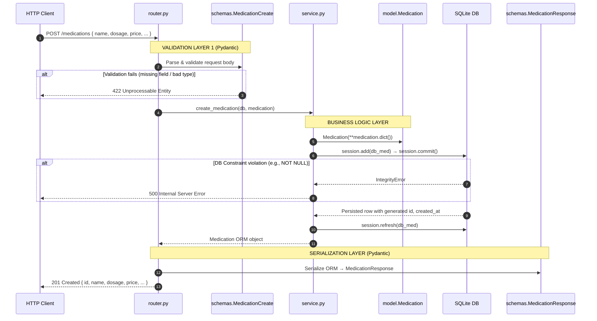

# Medications Module — Technical Reference

> **Audience**: Frontend Engineers, QA Engineers, Backend Reviewers
> **Version**: 2.0.0 | **Date**: 2026-03-06 | **Reflects model.py final state**

---

## Pre-Design Reasoning

### 1. Future Entities That Will Reference `medications`

Each entity below will carry a FK into `medications.id`. The current table is already structured to accept all of them without schema modification.

| Future Entity             | Relationship Type | Cardinality                                   | Description                                     |
| :------------------------ | :---------------- | :-------------------------------------------- | :---------------------------------------------- |
| `dispensations`           | Has-Many          | `medications` 1 → N `dispensations`           | Each dispense event references one medication.  |
| `purchase_order_items`    | Has-Many          | `medications` 1 → N `purchase_order_items`    | Procurement lines per medication.               |
| `prescription_lines`      | Has-Many          | `medications` 1 → N `prescription_lines`      | Each prescription line maps to one medication.  |
| `stock_adjustments`       | Has-Many          | `medications` 1 → N `stock_adjustments`       | Audit log for every stock delta event.          |
| `admission_medications`   | Many-to-Many      | via `admission_medications` junction table    | Medications administered in emergency admissions. |
| `therapeutic_categories`  | Belongs-To        | `medications` N → 1 `therapeutic_categories`  | Drug family / classification catalog.           |

---

### 2. Indexing Candidates

| Field                      | Index Type | Justification                                                                                     |
| :------------------------- | :--------- | :------------------------------------------------------------------------------------------------ |
| `id`                       | Primary    | SQLite ROWID alias — zero cost, always present.                                                  |
| `name`                     | B-Tree     | Most frequent search target (`GET /medications?name=...`). Prevents full-table scans.            |
| `therapeutic_category_id`  | B-Tree     | High-frequency JOIN target from dispensations and prescriptions.                                 |
| `generic_name`             | None       | Part of the composite UNIQUE constraint (handled by the constraint index, not a separate index). |
| `stock_quantity`           | None       | Range-filtered (e.g., `< threshold`), not equality-checked; index not cost-effective in SQLite.  |
| `created_at`               | None       | Audit/sort only; low selectivity when records cluster around recent timestamps.                   |

---

### 3. Modeling `therapeutic_category`

**Decision: FK to a `therapeutic_categories` catalog table.**

| Option               | Pros                                                              | Cons                                                                              |
| :------------------- | :---------------------------------------------------------------- | :-------------------------------------------------------------------------------- |
| Plain string         | No joins needed                                                   | Typos → inconsistent data; cannot list or filter reliably                         |
| Enum                 | Validated, memory-efficient                                       | Migration required to add any new category; brittle for evolving formularies      |
| **FK to catalog** ✅ | Consistent, listable, extensible via API; DB-enforced membership  | One JOIN required for reads; minor added complexity                               |

**SQLite note**: FK constraints are enforced when `PRAGMA foreign_keys = ON` is set per connection. `database.py` fires this pragma via an `@event.listens_for(engine, "connect")` listener, so it applies to every connection — production and test alike.

---

## A) Entity-Relationship Diagram (ERD)

> **Constraints not shown in ERD syntax**:
> `UNIQUE(name, generic_name)` — composite constraint named `uq_medication_name_generic`. Prevents two rows from sharing the same brand + active-ingredient identity.

> **FK placeholders**: `DISPENSATIONS`, `PURCHASE_ORDER_ITEMS`, `PRESCRIPTION_LINES`, `STOCK_ADJUSTMENTS`, `ADMISSION_MEDICATIONS` do not exist yet. No changes to `medications` are needed when those modules are added.

---

## B) Data Flow Diagram — POST /medications

### Error-to-HTTP-Code Mapping

| Error Condition                          | Where Caught              | HTTP Code | Exception Class                          |
| :--------------------------------------- | :------------------------ | :-------- | :--------------------------------------- |
| Missing required field / wrong type      | Pydantic (router)         | `422`     | `RequestValidationError` (FastAPI)       |
| `price ≤ 0` or `stock_quantity < 0`      | Pydantic (router)         | `422`     | `RequestValidationError` (FastAPI)       |
| Medication ID not found                  | `service.get_medication`  | `404`     | `MedicationNotFoundException`            |
| Insufficient stock for dispense          | `service.adjust_stock`    | `400`     | `InsufficientStockException`             |
| Duplicate `(name, generic_name)` pair    | SQLAlchemy → DB           | `500`*    | `IntegrityError` — *map to `409` in prod*|
| FK violation (`therapeutic_category_id`) | SQLAlchemy → DB           | `500`*    | `IntegrityError` — *map to `422` in prod*|
| Invalid path parameter type              | FastAPI                   | `422`     | `RequestValidationError` (FastAPI)       |

---

## C) Field Decision Table

| Field Name                 | Data Type        | Nullable | Default        | Editable via PATCH     | Notes                                                                                                       |
| :------------------------- | :--------------- | :------- | :------------- | :--------------------- | :---------------------------------------------------------------------------------------------------------- |
| `id`                       | `INTEGER`        | No       | Auto (PK)      | ❌ No                  | SQLite ROWID alias. Compact FK target for child tables.                                                    |
| `name`                     | `VARCHAR(200)`   | No       | —              | ✅ Yes                 | Indexed. Part of the composite UNIQUE key with `generic_name`.                                             |
| `generic_name`             | `VARCHAR(200)`   | No       | —              | ✅ Yes                 | INN / active ingredient name. Part of `UNIQUE(name, generic_name)`. Cannot be empty.                      |
| `dosage`                   | `VARCHAR(100)`   | No       | —              | ✅ Yes                 | Free-text strength (e.g., `500 mg`, `10 mg/5 ml`). May split into `dosage_value` + `dosage_unit` in v2.  |
| `unit`                     | `VARCHAR(20)`    | Yes      | `NULL`         | ✅ Yes                 | Dispensing unit (e.g., `tablet`, `ml`). Nullable; not all medications use a discrete unit.                |
| `description`              | `VARCHAR(500)`   | Yes      | `NULL`         | ✅ Yes                 | Optional clinical notes or storage instructions. No DB constraint.                                        |
| `price`                    | `NUMERIC(10, 2)` | No       | —              | ✅ Yes                 | **Not FLOAT**. `NUMERIC` stores as text-encoded decimal in SQLite, avoiding IEEE 754 rounding errors.     |
| `stock_quantity`           | `INTEGER`        | No       | `0`            | ✅ Yes (stock endpoint) | Managed via `POST /{id}/stock`. Direct PATCH allowed but bypasses stock event auditing.                  |
| `min_stock_threshold`      | `INTEGER`        | No       | `0`            | ✅ Yes                 | Reorder alert level. `0` = alerting not configured. Used by a future notification module.                 |
| `therapeutic_category_id`  | `INTEGER` (FK)   | Yes      | `NULL`         | ✅ Yes                 | FK → `therapeutic_categories.id`. Nullable so drugs can be added before the catalog is populated.        |
| `expiration_date`          | `DATE`           | Yes      | `NULL`         | ✅ Yes                 | Batch expiry. Null for non-expiring consumables (e.g., durable medical equipment).                       |
| `is_active`                | `BOOLEAN`        | No       | `True`         | ✅ Yes                 | Soft-delete flag. SQLite stores as `INTEGER` 0/1. Inactive medications hidden from orders/prescriptions.  |
| `created_at`               | `DATETIME`       | No       | `server_default=func.now()` | ❌ No    | DB-generated on INSERT. Application code must never override this.                                       |
| `updated_at`               | `DATETIME`       | Yes      | `server_default=func.now()` | ❌ No (auto-set) | `onupdate=datetime.utcnow` — Python callable invoked by SQLAlchemy on every ORM UPDATE. `NULL` until first modification. |

---

> **QA Integration Test Hints**
> - `POST /medications` missing `generic_name` → expect `422`.
> - `POST /medications` with `price: 0` → expect `422`.
> - `POST /medications` same `(name, generic_name)` twice → expect `409` (once handler is added).
> - `GET /medications/99999` → expect `404`.
> - `POST /medications/1/stock?quantity=-9999` when `stock_quantity` is `5` → expect `400`.
> - `PATCH /medications/1` with `{}` empty body → expect `200` (no-op; `exclude_unset=True` prevents field overwriting).
> - `PATCH /medications/1` setting `is_active: false` → expect `200`; verify record excluded from active listings.

---

## Pre-Design Reasoning

### 1. Future Entities That Will Reference `medications`

The following entities are anticipated in the Hospital Management System. Each will hold a Foreign Key into `medications.id`.

| Future Entity           | Relationship Type | Cardinality           | Description                                                    |
| :---------------------- | :---------------- | :-------------------- | :------------------------------------------------------------- |
| `dispensations`         | Has-Many          | `medications` 1 → N `dispensations` | Each dispense event references one medication.    |
| `purchase_orders`       | Has-Many          | `medications` 1 → N `purchase_order_items` | Procurement lines per medication.          |
| `emergency_admissions`  | Many-to-Many      | via `admission_medications` junction table | Medications administered per emergency admission. |
| `prescriptions`         | Has-Many          | `medications` 1 → N `prescription_lines` | Each prescription line maps to one medication. |
| `stock_adjustments`     | Has-Many          | `medications` 1 → N `stock_adjustments` | Audit log for every stock delta. |
| `therapeutic_categories`| Belongs-To        | `medications` N → 1 `therapeutic_categories` | Catalog of drug families. |

---

### 2. Indexing Candidates

| Field              | Index Type | Justification                                                                                  |
| :----------------- | :--------- | :--------------------------------------------------------------------------------------------- |
| `id`               | Primary    | Always indexed by SQLite as the primary key.                                                  |
| `name`             | B-Tree     | Used in lookup queries (`GET /medications?name=...`). Prevents full-table scans at scale.    |
| `therapeutic_category_id` | B-Tree | JOIN target from `dispensations` and `prescriptions`; high query frequency expected.   |
| `stock_quantity`   | None       | Typically filtered as a range (e.g., `stock < 10`), not an equality check; index not worthwhile in SQLite. |
| `created_at`       | None       | Only used for audit/display sorting; low selectivity when recent records cluster together.     |

---

### 3. Modeling `therapeutic_category`

**Recommendation: FK to a `therapeutic_categories` catalog table.**

| Option          | Pros | Cons |
| :-------------- | :--- | :--- |
| **Plain string** | Simple, no joins needed | Inconsistent data (case typos), no centralized validation, cannot be listed/filtered reliably |
| **Enum** | Validated and memory-efficient | Requires a migration to add any new category; brittle for a real-world pharmacy with evolving categories |
| **FK to catalog table** ✅ | Consistent, listable, extensible via API; validates membership via DB foreign key | Requires a join for reads; mild extra complexity |

**For SQLite specifically**: SQLite supports foreign key constraints when `PRAGMA foreign_keys = ON` is set. Enforcing this at the engine level in `database.py` cements data integrity without sacrificing SQLite compatibility.

---

## A) Entity-Relationship Diagram (ERD)

> **Note**: Entities greyed out (`DISPENSATIONS`, `PURCHASE_ORDER_ITEMS`, etc.) are **FK placeholders** — their tables do not exist yet. `medications.id` is already structured to accept these FKs without modification when those modules are added.

---

## B) Data Flow Diagram — POST /medications

### Error-to-HTTP-Code Mapping

| Error Condition                    | Where Caught         | HTTP Code | Exception Class                   |
| :--------------------------------- | :------------------- | :-------- | :-------------------------------- |
| Missing/invalid field in body      | Pydantic (router)    | `422`     | `RequestValidationError` (FastAPI built-in) |
| Medication ID not found            | `service.get_medication` | `404` | `MedicationNotFoundException`     |
| Insufficient stock (`delta < 0`)   | `service.adjust_stock` | `400`   | `InsufficientStockException`      |
| DB integrity constraint violation  | SQLAlchemy           | `500`     | `IntegrityError` (unhandled — add a handler for production) |
| Invalid path parameter type        | FastAPI              | `422`     | `RequestValidationError`          |

---

## C) Field Decision Table

| Field Name              | Data Type    | Nullable | Default      | Editable via PATCH | Notes                                                                                       |
| :---------------------- | :----------- | :------- | :----------- | :----------------- | :------------------------------------------------------------------------------------------ |
| `id`                    | `INTEGER`    | No       | Auto (PK)    | ❌ No              | Auto-incremented primary key. Never exposed as a writable field.                           |
| `name`                  | `VARCHAR`    | No       | None         | ✅ Yes             | Indexed for fast search queries. Cannot be empty.                                          |
| `description`           | `TEXT`       | Yes      | `NULL`       | ✅ Yes             | Optional human-readable detail. No DB constraint enforced — relies on Pydantic `Optional`. |
| `dosage`                | `VARCHAR`    | No       | None         | ✅ Yes             | Free-text (e.g., "500mg", "2 tablets"). Future versions may split into value + unit.      |
| `stock_quantity`        | `INTEGER`    | No       | `0`          | ✅ Yes (via stock endpoint) | Managed primarily via `POST /{id}/stock`. Direct PATCH allowed but not preferred. Pydantic enforces `ge=0`. |
| `price`                 | `FLOAT`      | No       | None         | ✅ Yes             | Pydantic enforces `gt=0`. SQLite stores as IEEE 754 double; suitable for display, not for financial calculations. |
| `therapeutic_category_id` | `INTEGER` | Yes      | `NULL`       | ✅ Yes             | FK to `therapeutic_categories.id`. Nullable to support medications added before the catalog is populated. |
| `created_at`            | `DATETIME`   | No       | `func.now()` | ❌ No              | Set by the DB server on insert. Never overridden by application code.                      |
| `updated_at`            | `DATETIME`   | Yes      | `NULL`       | ❌ No (auto-set)   | Set automatically by SQLAlchemy `onupdate`. Will be `NULL` until the first PATCH.         |

---

> **QA Integration Test Hints**
> - `POST /medications` with `price: 0` → expect `422`.
> - `GET /medications/99999` → expect `404`.
> - `POST /medications/1/stock?quantity=-9999` when stock is `5` → expect `400`.
> - `PATCH /medications/1` with `{}` empty body → expect `200` (no-op; `exclude_unset` prevents overwriting).
