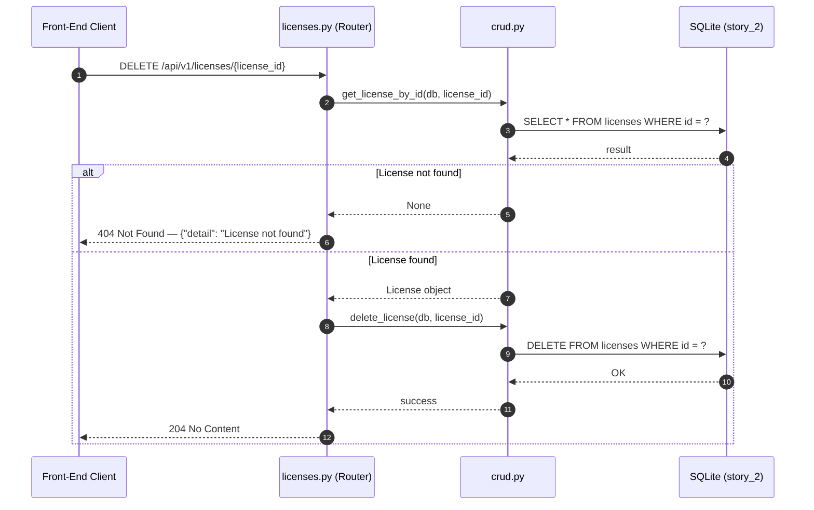

```mermaid
sequenceDiagram
    autonumber
    participant Client as Front-End Client
    participant Router as licenses.py (Router)
    participant CRUD as crud.py
    participant DB as SQLite (story_2)

    Client->>Router: DELETE /api/v1/licenses/{license_id}
    Router->>CRUD: get_license_by_id(db, license_id)
    CRUD->>DB: SELECT * FROM licenses WHERE id = ?
    DB-->>CRUD: result

    alt License not found
        CRUD-->>Router: None
        Router-->>Client: 404 Not Found — {"detail": "License not found"}
    else License found
        CRUD-->>Router: License object
        Router->>CRUD: delete_license(db, license_id)
        CRUD->>DB: DELETE FROM licenses WHERE id = ?
        DB-->>CRUD: OK
        CRUD-->>Router: success
        Router-->>Client: 204 No Content
    end
```
