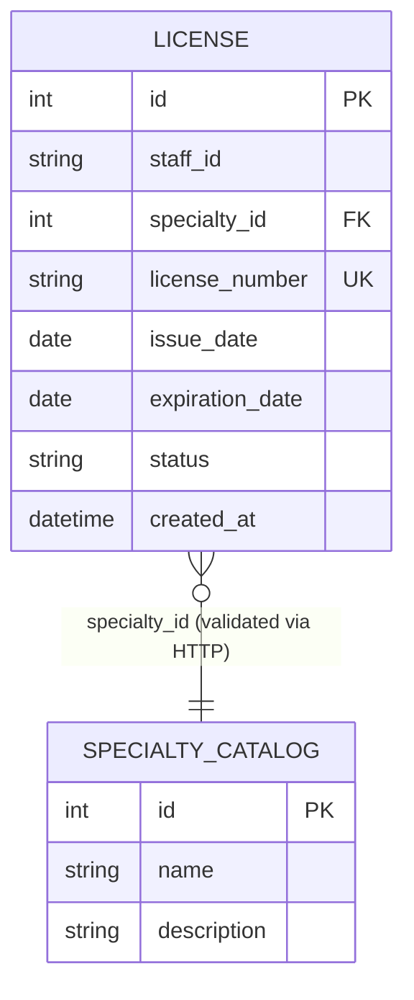

```mermaid
erDiagram
    LICENSE {
        int id PK
        string staff_id
        int specialty_id FK
        string license_number UK
        date issue_date
        date expiration_date
        string status
        datetime created_at
    }

    SPECIALTY_CATALOG {
        int id PK
        string name
        string description
    }

    LICENSE }o--|| SPECIALTY_CATALOG : "specialty_id (validated via HTTP)"
```
