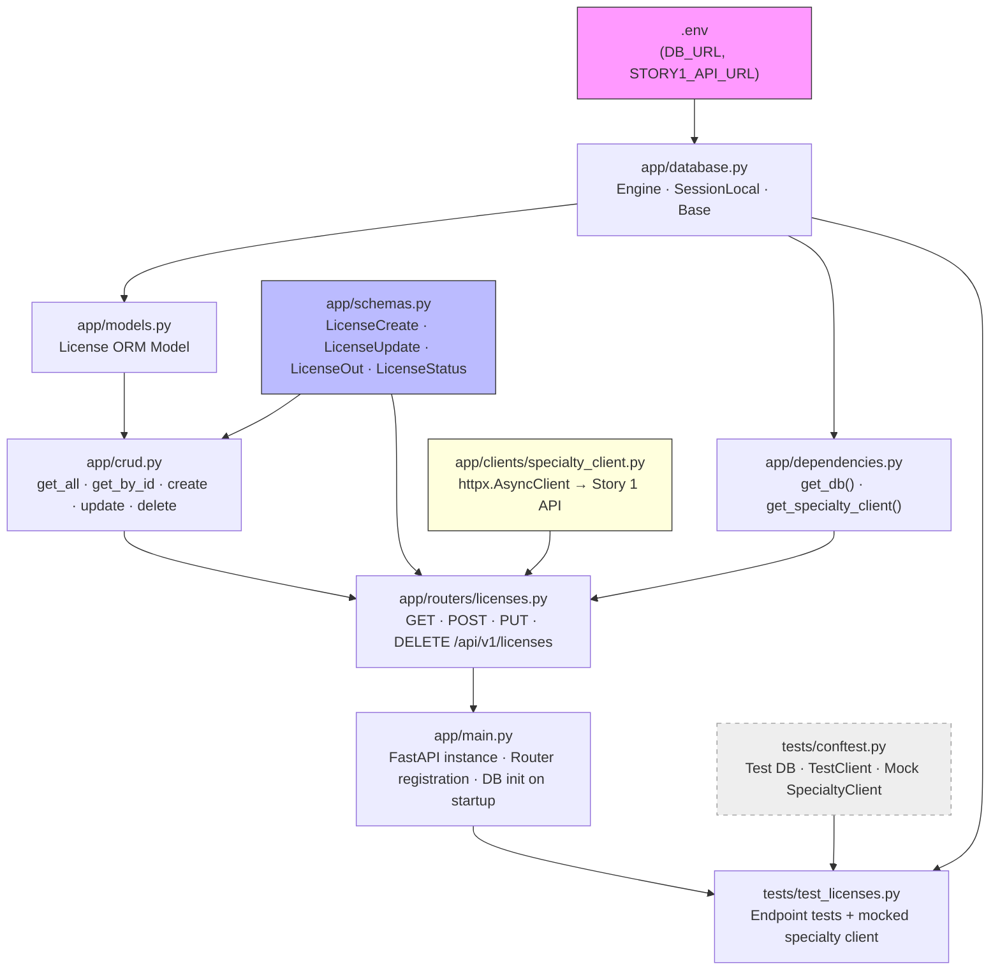

```mermaid
graph TD
    ENV[".env\n(DB_URL, STORY1_API_URL)"] --> DB["app/database.py\nEngine · SessionLocal · Base"]
    DB --> MODELS["app/models.py\nLicense ORM Model"]
    DB --> DEPS["app/dependencies.py\nget_db() · get_specialty_client()"]
    MODELS --> CRUD["app/crud.py\nget_all · get_by_id · create · update · delete"]
    SCHEMAS["app/schemas.py\nLicenseCreate · LicenseUpdate · LicenseOut · LicenseStatus"] --> CRUD
    SCHEMAS --> ROUTER["app/routers/licenses.py\nGET · POST · PUT · DELETE /api/v1/licenses"]
    CRUD --> ROUTER
    DEPS --> ROUTER
    CLIENT["app/clients/specialty_client.py\nhttpx.AsyncClient → Story 1 API"] --> ROUTER
    ROUTER --> MAIN["app/main.py\nFastAPI instance · Router registration · DB init on startup"]
    MAIN --> TESTS["tests/test_licenses.py\nEndpoint tests + mocked specialty client"]
    CONFTEST["tests/conftest.py\nTest DB · TestClient · Mock SpecialtyClient"] --> TESTS
    DB --> TESTS

    style ENV fill:#f9f,stroke:#333
    style SCHEMAS fill:#bbf,stroke:#333
    style CLIENT fill:#ffd,stroke:#333
    style CONFTEST fill:#eee,stroke:#999,stroke-dasharray: 5 5
```
