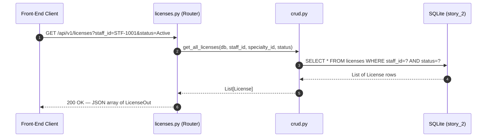

```mermaid
sequenceDiagram
    autonumber
    participant Client as Front-End Client
    participant Router as licenses.py (Router)
    participant CRUD as crud.py
    participant DB as SQLite (story_2)

    Client->>Router: GET /api/v1/licenses?staff_id=STF-1001&status=Active
    Router->>CRUD: get_all_licenses(db, staff_id, specialty_id, status)
    CRUD->>DB: SELECT * FROM licenses WHERE staff_id=? AND status=?
    DB-->>CRUD: List of License rows
    CRUD-->>Router: List[License]
    Router-->>Client: 200 OK — JSON array of LicenseOut
```
