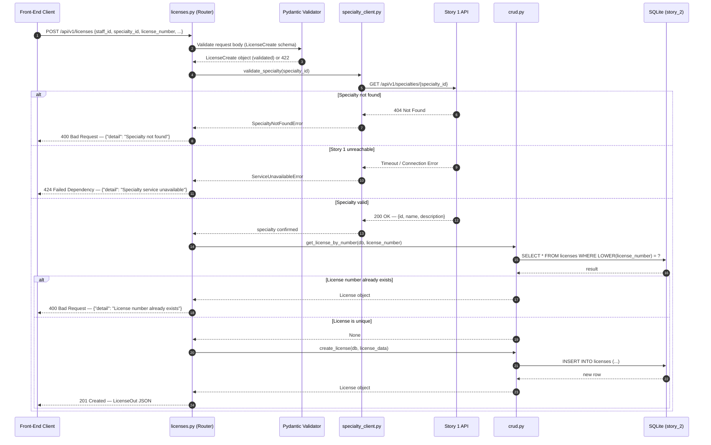

```mermaid
sequenceDiagram
    autonumber
    participant Client as Front-End Client
    participant Router as licenses.py (Router)
    participant PV as Pydantic Validator
    participant SC as specialty_client.py
    participant S1 as Story 1 API
    participant CRUD as crud.py
    participant DB as SQLite (story_2)

    Client->>Router: POST /api/v1/licenses {staff_id, specialty_id, license_number, ...}
    Router->>PV: Validate request body (LicenseCreate schema)
    PV-->>Router: LicenseCreate object (validated) or 422

    Router->>SC: validate_specialty(specialty_id)
    SC->>S1: GET /api/v1/specialties/{specialty_id}

    alt Specialty not found
        S1-->>SC: 404 Not Found
        SC-->>Router: SpecialtyNotFoundError
        Router-->>Client: 400 Bad Request — {"detail": "Specialty not found"}
    else Story 1 unreachable
        S1-->>SC: Timeout / Connection Error
        SC-->>Router: ServiceUnavailableError
        Router-->>Client: 424 Failed Dependency — {"detail": "Specialty service unavailable"}
    else Specialty valid
        S1-->>SC: 200 OK — {id, name, description}
        SC-->>Router: specialty confirmed

        Router->>CRUD: get_license_by_number(db, license_number)
        CRUD->>DB: SELECT * FROM licenses WHERE LOWER(license_number) = ?
        DB-->>CRUD: result

        alt License number already exists
            CRUD-->>Router: License object
            Router-->>Client: 400 Bad Request — {"detail": "License number already exists"}
        else License is unique
            CRUD-->>Router: None
            Router->>CRUD: create_license(db, license_data)
            CRUD->>DB: INSERT INTO licenses (...)
            DB-->>CRUD: new row
            CRUD-->>Router: License object
            Router-->>Client: 201 Created — LicenseOut JSON
        end
    end
```
