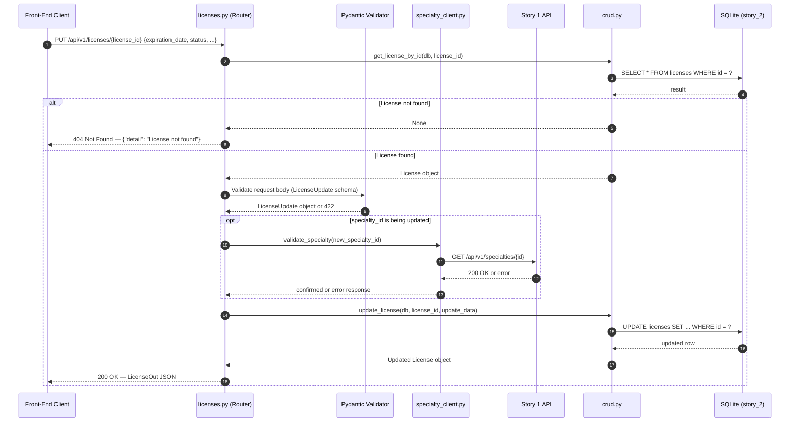

```mermaid
sequenceDiagram
    autonumber
    participant Client as Front-End Client
    participant Router as licenses.py (Router)
    participant PV as Pydantic Validator
    participant SC as specialty_client.py
    participant S1 as Story 1 API
    participant CRUD as crud.py
    participant DB as SQLite (story_2)

    Client->>Router: PUT /api/v1/licenses/{license_id} {expiration_date, status, ...}
    Router->>CRUD: get_license_by_id(db, license_id)
    CRUD->>DB: SELECT * FROM licenses WHERE id = ?
    DB-->>CRUD: result

    alt License not found
        CRUD-->>Router: None
        Router-->>Client: 404 Not Found — {"detail": "License not found"}
    else License found
        CRUD-->>Router: License object
        Router->>PV: Validate request body (LicenseUpdate schema)
        PV-->>Router: LicenseUpdate object or 422

        opt specialty_id is being updated
            Router->>SC: validate_specialty(new_specialty_id)
            SC->>S1: GET /api/v1/specialties/{id}
            S1-->>SC: 200 OK or error
            SC-->>Router: confirmed or error response
        end

        Router->>CRUD: update_license(db, license_id, update_data)
        CRUD->>DB: UPDATE licenses SET ... WHERE id = ?
        DB-->>CRUD: updated row
        CRUD-->>Router: Updated License object
        Router-->>Client: 200 OK — LicenseOut JSON
    end
```
