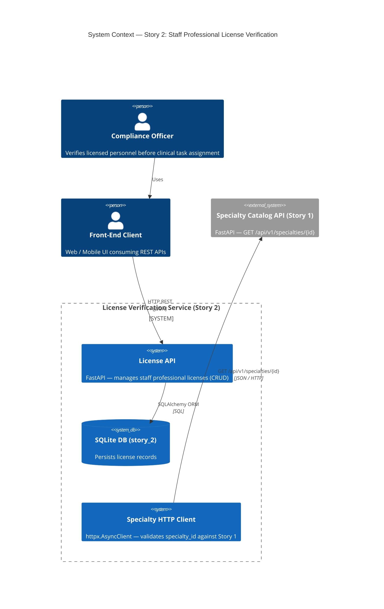

```mermaid
C4Context
    title System Context — Story 2: Staff Professional License Verification

    Person(compliance, "Compliance Officer", "Verifies licensed personnel before clinical task assignment")
    Person(frontEnd, "Front-End Client", "Web / Mobile UI consuming REST APIs")

    System_Boundary(story2, "License Verification Service (Story 2)") {
        System(licenseApi, "License API", "FastAPI — manages staff professional licenses (CRUD)")
        SystemDb(licenseDb, "SQLite DB (story_2)", "Persists license records")
        System(specialtyClient, "Specialty HTTP Client", "httpx.AsyncClient — validates specialty_id against Story 1")
    }

    System_Ext(story1, "Specialty Catalog API (Story 1)", "FastAPI — GET /api/v1/specialties/{id}")

    Rel(compliance, frontEnd, "Uses")
    Rel(frontEnd, licenseApi, "HTTP REST", "JSON")
    Rel(licenseApi, licenseDb, "SQLAlchemy ORM", "SQL")
    Rel(specialtyClient, story1, "GET /api/v1/specialties/{id}", "JSON / HTTP")
```
