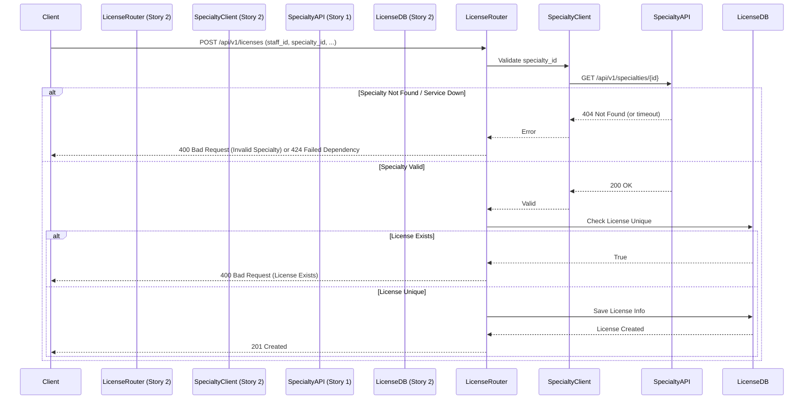

# Story 2: Staff Professional License Verification Service

## 1. Business Requirements

### Goal
As a Compliance Officer, I want to link staff members to their professional license IDs to ensure only licensed personnel are assigned to clinical tasks.

### Core Features
- Create, Read, Update, and Delete (CRUD) operations for professional licenses.
- Each license must belong to a staff member (staff_id) and link to a valid medical specialty (specialty_id).
- Validate license IDs (e.g., uniqueness, format).
- Track license status (Active, Expired, Suspended).
- Track expiration dates for compliance.

### Integration with Story 1 (Specialty Catalog)
Licenses must reference a `specialty_id` that exists in the Specialty Catalog. 
**Recommended Approach**: Shared Database Reference (Foreign Key if using a shared DB) or API-level validation (HTTP GET request to `GET /api/v1/specialties/{id}`) if microservices. Given the constraint of isolated folders but same tech stack, we will assume an API-level validation approach (HTTP call to Story 1's service) or a shared database schema where both stories access the same SQLite DB file. For complete isolation, we will implement an HTTP Client in Story 2 that fetches from Story 1.

## 2. Detailed File Structure for `story_2/`

```text
hospital_management/
└── story_2/
    ├── app/
    │   ├── __init__.py          # Marks app as a package
    │   ├── main.py              # FastAPI application instance, CORS, routers registration
    │   ├── database.py          # SQLAlchemy engine, session maker, Base declaration
    │   ├── models.py            # SQLAlchemy ORM models (License entity)
    │   ├── schemas.py           # Pydantic v2 models (LicenseCreate, LicenseRead, etc.)
    │   ├── crud.py              # Database operations (get, create, update, delete licenses)
    │   ├── dependencies.py      # FastAPI dependencies (database session, HTTP client for Story 1)
    │   ├── clients/             # External service clients
    │   │   ├── __init__.py
    │   │   └── specialty_client.py # HTTP client to communicate with Story 1's API
    │   └── routers/
    │       ├── __init__.py
    │       └── licenses.py      # API endpoints (GET, POST, PUT, DELETE /api/v1/licenses)
    ├── tests/
    │   ├── __init__.py
    │   ├── conftest.py          # Pytest fixtures (test DB, client, mock specialties client)
    │   └── test_licenses.py     # Unit and integration tests for licenses endpoints
    ├── .env                     # Environment variables (DB URL, Story 1 API URL)
    ├── requirements.txt         # Dependencies (fastapi, pydantic, sqlalchemy, httpx, pytest)
    └── README.md                # Story 2 specific run instructions and documentation
```

## 3. Endpoints & Request/Response Contracts

### `POST /api/v1/licenses`
Create a new professional license record.

**Request Body**
```json
{
  "staff_id": "STF-1001",
  "specialty_id": 5,
  "license_number": "MD-987654321",
  "issue_date": "2023-01-15",
  "expiration_date": "2025-01-15",
  "status": "Active"
}
```

**Responses**
- `201 Created`: Successfully created.
  ```json
  {
    "id": 1,
    "staff_id": "STF-1001",
    "specialty_id": 5,
    "license_number": "MD-987654321",
    "issue_date": "2023-01-15",
    "expiration_date": "2025-01-15",
    "status": "Active",
    "created_at": "2023-10-01T12:00:00Z"
  }
  ```
- `400 Bad Request`: Validation error (e.g., license_number already exists).
- `422 Unprocessable Entity`: Invalid generic JSON payload.
- `424 Failed Dependency`: specialty_id not found in Story 1 or Service Unavailable.

### `GET /api/v1/licenses`
Retrieve all professional licenses, with optional filters.

**Query Parameters**
- `staff_id` (optional): Filter by staff ID.
- `specialty_id` (optional): Filter by specialty ID.
- `status` (optional): Filter by status.

**Responses**
- `200 OK`: 
  ```json
  [
    {
      "id": 1,
      "staff_id": "STF-1001",
      "specialty_id": 5,
      "license_number": "MD-987654321",
      "issue_date": "2023-01-15",
      "expiration_date": "2025-01-15",
      "status": "Active",
      "created_at": "2023-10-01T12:00:00Z"
    }
  ]
  ```

### `GET /api/v1/licenses/{license_id}`
Retrieve a specific license by ID.

### `PUT /api/v1/licenses/{license_id}`
Update an existing license (e.g., renew expiration date or change status).

### `DELETE /api/v1/licenses/{license_id}`
Remove a license record.

## 4. Error Handling & Uniqueness

- **Uniqueness**: `license_number` must be unique system-wide (case-insensitive). The DB schema will enforce a unique constraint, and `crud.py` will catch IntegrityError or proactively check existence.
- **External Dependency Failure**: If Story 1 API is unreachable during `POST` or `PUT`, the service should return `503 Service Unavailable` or `424 Failed Dependency`.

## 5. Sequence Diagrams

### Create License Flow


## 6. Integration Notes

- **HTTPX for Sync/Async Calls**: Story 2 will use `httpx.AsyncClient` in `specialty_client.py` to make REST calls to Story 1 running locally (e.g., at `http://localhost:8000/api/v1/specialties/`).
- **Resiliency**: Implement basic timeout settings in the HTTP client so Story 2 does not hang indefinitely if Story 1 fails to respond.
- **Testing**: `test_licenses.py` will use `unittest.mock` or `pytest-httpx` to mock responses from Story 1 to fully isolate the test suite of Story 2.
